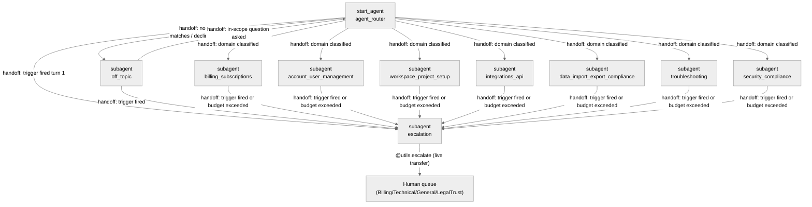

# Agent Spec: Ask_Nimbus

## Purpose & Scope

Ask Nimbus is a deterministic, RAG-grounded FAQ agent for Nimbus Workspace (a
fictional B2B SaaS company). It answers customer questions strictly from
Salesforce Knowledge via an Agentforce Data Library (ADL), and hands off to a
human agent through exactly one write action (Case creation/update) when a
conversation requires it. It has no other write capability: it cannot process
refunds, change plans, delete data, or modify any account or user record.

## Behavioral Intent

- The agent must never answer a substantive question without first calling
  `AnswerQuestionsWithKnowledge` and must never answer from its own trained
  knowledge when the returned `knowledgeSummary` is empty or non-substantive.
- Five trigger families force immediate escalation regardless of the active
  subagent: explicit human request, security/fraud keywords, GDPR/data-deletion
  requests, transactional intent (asking the agent to *execute* a change), and
  account-specific requests that Knowledge cannot answer. These bypass the
  unresolved-turn counter.
- Retrieval is capped at 2 attempts per question and 3 chained retrievals per
  turn; a session is capped at 12 substantive turns before the agent proactively
  offers a human hand-off; 3 low-confidence/unhelpful responses force escalation.
- Clarifying questions are capped at 2 consecutive per topic before the agent
  proceeds best-effort or escalates.
- The only implemented action types are: one Apex escalation action
  (`NimbusEscalationService.escalateToHuman`, already deployed) and the
  platform-standard `AnswerQuestionsWithKnowledge` knowledge-retrieval action
  (wired to the pre-provisioned ADL). No new Apex/Flow/Prompt Template
  implementations were created for this build.
- Exact machine-known facts that MUST drive deterministic runtime logic:
  reason-code selection for escalation (a fixed enum, never free LLM text),
  the retrieval/unresolved/clarifying counters and their thresholds, and the
  domain → queue-hint mapping.
- Conversational facts that remain in surviving history and need no variable:
  the user's name, which specific question they asked, prior answers given,
  and ordinary follow-up context — none of these have a runtime consumer.

## Subagent Posture

| Subagent | Posture | Why this posture? | Deterministic controls |
|----------|---------|--------------------|-------------------------|
| `agent_router` | Scripted | Routing must not answer the underlying request; classification-only with one next outcome per branch | Escalation-flag redirect check |
| 7 domain subagents (billing, account, workspace, integrations, data/compliance, troubleshooting, security) | Mixed | The model must interpret free-text questions and compose grounded answers (agentic surface), but retrieval budget, escalation triggers, turn ceiling, and reason-code selection are trust/consequence-bearing and must not vary (scripted surface) | `before_reasoning` topic-change reset; top-of-instructions deterministic redirects on `escalation_reason_code`, `retrieval_attempts >= 2`, `unresolved_turns >= 3`; fixed-enum `setVariables` trigger actions |
| `off_topic` | Scripted | Single fixed decline-and-redirect duty, no free-form answering | Same escalation-flag redirect check |
| `escalation` | Scripted | Regulated, auditable hand-off; exactly one Apex call then one live-transfer call, machine-gated by trusted action output | `available when` sequential gate on `escalation_case_created` |

This is a mostly-scripted, low-agentic-freedom FAQ agent: the only genuinely
agentic surface is composing a grounded answer from `knowledgeSummary` and
recognizing the five trigger families from free text (which AgentScript cannot
inspect deterministically — see Deterministic Controls below). Every
consequential decision downstream of that recognition — which reason code is
sent to Apex, which queue is hinted, when retrieval gives up, when the turn
ceiling forces an offer, when the unresolved-turn counter forces escalation —
is a runtime predicate, not model discretion.

## Subagent Map



All transitions are **handoffs** (`@utils.transition to` / bare `transition to`
+ final `@utils.escalate`) — none are delegation-with-return. Every domain
subagent's escalation path is a one-way handoff into `escalation`; there is no
return transition, matching the six-gate requirement that all trigger paths
terminate in the escalation subagent.

## Variables

| Variable | Type / Default | Trusted Writer | Named Consumer | Cause | Reset / Expiry / Correction / Cancel |
|----------|----------------|-----------------|-----------------|-------|----------------------------------------|
| `session_id` | `linked string`, `source: @MessagingSession.Id` | Platform messaging-session context | `escalate_to_human` input `sessionId` | Idempotency key required by Apex | N/A — linked, platform-owned |
| `escalation_reason_code` | `mutable string = ""` | The 5 fixed-enum `trigger_*` actions in every subagent, plus the retrieval-budget and unresolved-turn deterministic checks | Every subagent's top-of-instructions redirect (`if != "": transition to escalation`); `escalate_to_human` input `reasonCode` | All six gates | Never reset after a successful hand-off — `escalation` is a terminal state for the session (see note below) |
| `pending_queue_hint` | `mutable string = ""` | Same triggers as above, each subagent hardcodes its own domain's queue literal | `escalate_to_human` input `queueHint` | Domain → queue mapping (FR8.5 equivalent) | Same lifecycle as `escalation_reason_code` |
| `retrieval_attempts` | `mutable number = 0` | `mark_retrieval_empty` (model-invoked, fixed increment) | Domain subagent's `retrieval_attempts >= 2` deterministic check | Retrieval budget / anti-hallucination | Reset to `0` on topic change (`before_reasoning`) |
| `unresolved_turns` | `mutable number = 0` | `mark_retrieval_empty` and `mark_response_unhelpful` (both model-invoked, fixed increment) | Domain subagent's `unresolved_turns >= 3` deterministic check | Forced escalation after repeated low confidence | Reset to `0` on topic change (`before_reasoning`) |
| `clarifying_questions_asked` | `mutable number = 0` | `mark_clarifying_question_asked` (model-invoked, fixed increment) | Domain instructions' 2-question cap guidance | Bounded disambiguation | Reset to `0` on topic change (`before_reasoning`) |
| `turn_count` | `mutable number = 0` | Every domain subagent's `before_reasoning` (unconditional increment) | Domain instructions' `turn_count >= 12` proactive-offer branch | Session turn ceiling | Never reset — session-scoped counter |
| `active_domain` | `mutable string = ""` | Every domain subagent's `before_reasoning` | The topic-change check that resets the three per-topic counters above | Topic-change detection | Overwritten every domain entry |
| `escalation_attempted` | `mutable boolean = False` | `escalate_to_human` output binding | Escalation subagent's retry-branch condition | Distinguish first attempt from retry | Never reset (escalation subagent is terminal) |
| `escalation_case_created` | `mutable boolean = False` | `escalate_to_human` output binding (`@outputs.isSuccess`) | Gates `escalate_to_human` (hides once `True`) and `hand_off_to_human` (shows once `True`) | Idempotent-retry safety + sequential gate | Never reset (escalation subagent is terminal) |
| `escalation_attempts` | `mutable number = 0` | `escalate_to_human` post-action `set` (fixed `+1`) | `escalate_to_human`'s `available when ... and escalation_attempts < 3` gate; the exhausted-attempts instruction branch | Bound repeated retries within one turn | Never reset (escalation subagent is terminal). **Known gap:** this counter only increments when the action call completes far enough to reach its post-action `set` directives; a hard transport/execution-level error (HTTP 500 before Apex runs, observed live when a required input arrives empty) bypasses the `set` entirely, so the cap does not bound retries in that specific failure mode — see Deviations/Findings. |

**Note on the "never reset" lifecycle of the four escalation-state
variables:** the escalation subagent is designed as a terminal state for the
session — after `hand_off_to_human` (`@utils.escalate`) succeeds, the channel
is expected to end the agent's turn and transfer the session. If a channel
configuration keeps the session alive afterward, leaving these variables set
means the agent stays parked in `escalation` and safely retries the live
hand-off rather than silently returning to answering FAQs after a human
hand-off was already promised. This is a deliberate design choice, not an
oversight — see the Deterministic Controls section for the reasoning.

Ordinary conversational facts (the user's name, which question was asked,
prior answers, current topic phrasing) are **not** mirrored into variables —
surviving conversation history carries them, and no runtime expression needs
the exact value.

## Actions

### AnswerQuestionsWithKnowledge (all 7 domain subagents)

- **Target:** `standardInvocableAction://streamKnowledgeSearch`
- **Status:** IMPLEMENTED (platform-standard action; ADL already provisioned and READY)
- **Wiring:** copied verbatim from `references/data-library-reference.md`,
  substituting `rag_feature_config_id: "ARFPC_1JDaj00000MT7PdGAL"` in the
  top-level `knowledge:` block. `retrieverId` `1Cxaj000000WCVtCAO` confirms the
  library is indexed.

#### Inputs

| Name | Type | Required | Source |
|------|------|----------|--------|
| query | string | Yes | LLM slot-fill (`...`) |
| citationsUrl | string | No | `@knowledge.citations_url` default |
| ragFeatureConfigId | string | No | `@knowledge.rag_feature_config_id` default |
| citationsEnabled | boolean | No | `@knowledge.citations_enabled` default |

#### Outputs

| Name | Type | Visible to User? | Notes |
|------|------|-------------------|-------|
| knowledgeSummary | object (`lightning__richTextType`) | Yes | The grounded answer; empty/non-substantive treated as below-confidence-floor |
| citationSources | object (`@apexClassType/AiCopilot__GenAiCitationInput`) | No | Source links; not deterministically joinable into `articlesServed` (see Deviations) |

### escalateToHuman (`escalation` subagent)

- **Target:** `apex://NimbusEscalationService`
- **Status:** IMPLEMENTED (deployed in Phase 2, not modified in this build)

#### Inputs

| Name | Type | Required | Source |
|------|------|----------|--------|
| sessionId | string | Yes | `@variables.session_id` (linked) |
| reasonCode | string | Yes | `@variables.escalation_reason_code` (fixed enum, never free LLM text) |
| intentSummary | string | Yes | LLM slot-fill (`...`), composed from conversation |
| transcript | string | Yes | LLM slot-fill (`...`), composed from conversation |
| sentimentTrend | string | Yes | LLM slot-fill (`...`), instructed to one of improving/flat/declining, default flat |
| articlesServed | string | Yes | LLM slot-fill (`...`), instructed to send the literal text `"none"` rather than `""` when no articles were served — the platform's invocable-action layer treats an empty string as a missing required value regardless of the Agent Script `is_required` setting, even though the underlying Apex only null-checks it (confirmed by live testing; see Deviations) |
| queueHint | string | No | `@variables.pending_queue_hint` (fixed enum literal per domain) |

#### Outputs

| Name | Type | Visible to User? | Notes |
|------|------|-------------------|-------|
| isSuccess | boolean | No (`filter_from_agent: True`) | Captured into `escalation_case_created` |
| caseId | string | No (`filter_from_agent: True`) | Not surfaced to the customer (internal Salesforce record Id; `id` Agent Script type is deprecated per local compiler, so declared as `string`) |
| errorMessage | string | No (`filter_from_agent: True`) | Drives the retry branch conversationally without echoing raw Apex text |

## Action Invocation Strategy

| Action | Subagent | Invocation Mode | Why |
|--------|----------|------------------|-----|
| AnswerQuestionsWithKnowledge | all 7 domains | Planner slot-fill (`with query=...`) | The model must judge when a question is substantive enough to search, and compose the search query |
| escalate_to_human (`escalateToHuman`) | escalation | Planner slot-fill, gated `available when escalation_case_created == False` | Requires model-composed `intentSummary`/`transcript`/`sentimentTrend`; the sequential gate makes it fire effectively automatically on entry since the else-branch instruction is unconditional |
| hand_off_to_human (`@utils.escalate`) | escalation | Planner slot-fill, gated `available when escalation_case_created == True` | Live transfer must not happen before the Case exists |
| `trigger_human_request` / `trigger_security_keyword` / `trigger_gdpr_request` / `trigger_transactional_intent` / `trigger_account_specific` | router, off_topic, all 7 domains | `@utils.setVariables` with fixed literal `set` clauses (no LLM-supplied values) | Model classifies *which* trigger applies (unavoidable — see Deterministic Controls); the value written is a hardcoded enum, never free text |
| `mark_retrieval_empty` / `mark_response_unhelpful` / `mark_clarifying_question_asked` | all 7 domains | `@utils.setVariables` with fixed `+1` increment | Model reports an event; the counter arithmetic and threshold enforcement are deterministic |

## Deterministic Controls (mapped to the six gates)

**Gate 1 — Forced-trigger check.** AgentScript's deterministic layer
(`before_reasoning`, `if` in `instructions: ->`) can only evaluate
`@variables`, `@outputs`, and `@inputs` — it has no documented mechanism to
inspect the raw user utterance (no substring/`contains` operator, no linked
variable exposing current message text). **None of the five triggers are
therefore truly pre-reasoning-deterministic** in the sense of running before
any LLM involvement. What IS fully deterministic: once the model recognizes a
trigger and calls the matching fixed-enum `trigger_*` action, the very next
reasoning iteration re-resolves `instructions: ->` and hits
`if @variables.escalation_reason_code != "": transition to @subagent.escalation`
**before the LLM is invoked again** — this transition cannot be second-guessed,
skipped, or overridden by model judgment, and the `reasonCode` value sent to
Apex is always one of the 8 valid enum literals, never freeform text. This
"model-classifies, runtime-dispatches-and-cannot-be-overridden" pattern is
identical for all five triggers; the difference between them is only in
prompt-level judgment burden:
- `human_request`, `security_keyword`, `gdpr_request` — crude, near-zero-judgment
  keyword/phrase recognition (per the source requirement's own intent).
- `transactional_intent`, `account_specific` — genuine intent classification,
  more judgment required, but identical deterministic dispatch once classified.

This shared pattern is replicated in the router, `off_topic`, and all 7 domain
subagents (not centralized, since AgentScript has no cross-subagent include
mechanism) so it applies "regardless of which domain subagent is active,"
including turn 1.

**Gate 2 — Routing.** `agent_router` is a router-first architecture: 7 domain
transition actions + `off_topic` for anything else (including the
always-declined categories — legal advice, medical advice, competitor
disparagement, non-Nimbus topics — encoded as router and `off_topic`
guardrail instructions). AgentScript has no platform-reserved "Off-Topic"
subagent primitive; `off_topic` is authored exactly per the documented
guardrail-subagent pattern (Core Language §4/Zen "Create a subagent only when
the boundary changes behavior").

**Gate 3 — Grounded retrieval with confidence floor.** `knowledgeSummary` is a
rich-text `object` output; the reference pattern for this action
(`data-library-reference.md`, `knowledge-grounded.agent`) treats emptiness as
a model judgment in prose ("Answer only from knowledgeSummary. If it is
empty..."), not a deterministic `== ""` comparison, because there is no
documented precedent for comparing this complex type deterministically. Ask
Nimbus follows that same convention: the model recognizes an empty/non
-substantive result and calls `mark_retrieval_empty`
(fixed `+1` to `retrieval_attempts` and `unresolved_turns`). The threshold
enforcement itself is 100% deterministic: `if @variables.retrieval_attempts >= 2:
set @variables.escalation_reason_code = "no_confident_answer" ... transition to
@subagent.escalation`, re-evaluated every reasoning iteration.

**Gate 4 — Response shape.** Clarifying-question cap (`clarifying_questions_asked`,
+1 per `mark_clarifying_question_asked` call, capped at 2 by instruction
guidance — the cap itself is not enforced by an `available when` gate because
"ask one question" is inherently a model judgment call, not a machine-checkable
precondition). Step-sequencing (≤3 steps = one response, ≥4 = walk through with
check-ins) is implemented as an **instruction-level approximation only** — there
is no persisted-variable step-navigation/back-button state, per the brief's
explicit allowance that this is nice-to-have, not required.

**Gate 5 — Conversation limits.** Retrieval budget = `retrieval_attempts`
(above). Turn ceiling = `turn_count`, incremented unconditionally in each
domain subagent's `before_reasoning`, checked in instructions (`>= 12` →
proactive hand-off offer, reusing the existing `trigger_human_request` action
if the user accepts — no new reason code needed). Unresolved-turns = same
mechanism as retrieval budget, plus `mark_response_unhelpful` for explicit
user dissatisfaction; reset on topic change via the `active_domain` check in
`before_reasoning`.

**Gate 6 — Escalation subagent.** All six trigger paths transition into the
single `escalation` subagent (see Subagent Map). It calls `escalateToHuman`
gated `available when escalation_case_created == False` (prevents a duplicate
call once the Case exists, though the Apex action is itself idempotent on
`sessionId`), captures `isSuccess`/`caseId`/`errorMessage` into variables, then
exposes `hand_off_to_human` (`@utils.escalate`) only once
`escalation_case_created == True` — a textbook External-Outcome Sequential
Gate. Instructions require a plain-language transition message before
`hand_off_to_human` is called (never a silent end of turn), and a retry
message (not a silent failure) if `isSuccess` is `False`.

## Architecture Pattern

Router-first (`start_agent agent_router`) with 7 domain subagents, one
guardrail subagent (`off_topic`), and one escalation subagent — required
because the agent has 7 genuinely distinct domains with different Knowledge
scopes and different queue-hint mappings, plus a security/compliance boundary
(Gate 1) and an escalation authority boundary (Gate 6) that must be separately
scoped per Core Language §4. All cross-subagent transitions are one-way
handoffs; none delegate-with-return, since no subagent needs to resume after
another subagent runs (each escalation path terminates the conversation via
the escalation subagent, and domain switches are user-driven re-routes, not
callbacks).

## Regression Test Suite

`tests/Ask_Nimbus-testing-center.yaml` — a Testing Center (`AiEvaluationDefinition`) suite covering 21 cases: all 7 domain routings, off-topic/legal-advice guardrails, all 5 forced-trigger escalation families (using the "delete my account data" phrasing that's confirmed to work, not the GDPR-worded phrasing blocked by the platform classifier above), an informational-vs-transactional pair per FR7.1 precision, a fully-specified request that must skip clarification, two ungroundable/no-fabrication checks, and a multi-intent utterance. Validated locally with `sf agent test create --spec tests/Ask_Nimbus-testing-center.yaml --api-name Ask_Nimbus_Regression --preview` — produces valid `AiEvaluationDefinition` XML, `status: 0`.

**Not yet deployed or run.** `sf agent test create`/`test run` require `subjectName` to resolve to a real `BotDefinition`, which only exists after `sf agent publish authoring-bundle` — publishing is the next explicit checkpoint, deliberately not taken in this pass (see Rule 6 / Deploy Reference). Once published (still short of activating), run:

```bash
sf agent test create --json --spec tests/Ask_Nimbus-testing-center.yaml --api-name Ask_Nimbus_Regression -o "AGENTFORCE AND DATA CLOUD"
sf agent test run --json --api-name Ask_Nimbus_Regression --wait 10 --result-format json -o "AGENTFORCE AND DATA CLOUD"
```

## Findings From Live Testing (require human review before publish)

1. **Platform-injected `Inappropriate_Content` node intercepts GDPR requests that name GDPR — but not plain deletion requests.** Confirmed independently (4 additional probes beyond the original 2) that the interception is narrower than "any data-deletion phrasing": it fires specifically when the utterance invokes GDPR/legal terminology alongside a deletion request —
   - ❌ "Please delete all my personal data" → `Inappropriate_Content`
   - ❌ "I would like to exercise my right to erasure under GDPR and have my personal data deleted." → `Inappropriate_Content`
   - ❌ "I want to invoke my GDPR right to be forgotten." → `Inappropriate_Content`
   - ✅ "Can you delete my account data please?" → routes correctly to `escalation`, `trigger_gdpr_request` fires, transition message delivered
   - ✅ "How does Nimbus handle GDPR compliance and data retention?" (informational, not a deletion request) → routes correctly to `data_import_export_compliance`, answered from Knowledge

   So the escalation path itself works — `trigger_gdpr_request`'s keyword matching already catches plain "delete my data/account" phrasing without the word GDPR. The platform-level classifier (not declared anywhere in `Ask_Nimbus.agent` or the local compiler's node list, and undocumented in the skill's reference set) specifically intercepts the combination of a deletion request *plus* explicit legal/regulatory framing ("GDPR," "right to erasure," "right to be forgotten") before our router or `before_reasoning` logic ever runs — this is not fixable from within Agent Script. **Residual risk**: a user submitting a *formal* GDPR request — arguably the highest-stakes phrasing, most likely from someone who already knows their legal rights — is exactly the phrasing this gate fails on. **Needs a human decision**: raise with Salesforce (or investigate Agentforce Studio / Einstein Trust Layer content-moderation sensitivity settings, which do not appear to be exposed via Metadata API or SOQL-queryable objects in this org) whether this classifier's sensitivity on legal-citation phrasing can be tuned. Until resolved, the practical mitigation is that the `trigger_gdpr_request` and `off_topic`/domain instructions already tell the model to treat plain-language deletion requests as the GDPR trigger, so most real users will still escalate correctly — only requests that explicitly cite GDPR/legal-rights terminology are at risk.
2. **`sessionId` cannot be populated via `sf agent preview`.** The `session_id` variable sources from `@MessagingSession.Id`, which — like the documented `@session`/`@context` preview limitation — does not resolve in a bare CLI preview session (no real messaging channel is attached). Every live-mode `escalateToHuman` call in preview fails with `REQUIRED_FIELD_MISSING: sessionId`. This is expected to work correctly once the agent runs behind a real messaging channel; it should be re-verified via Agentforce Testing Center or a real channel session before publish, since CLI preview cannot prove this path end-to-end.
3. **Apex's `articlesServed` required-field check rejects an empty string at the platform level, independent of Agent Script's `is_required` setting.** `NimbusEscalationService.Request.articlesServed` is `@InvocableVariable(required=true)`. Live testing showed the platform's invocable-action dispatcher rejects an empty-string value for this field with `REQUIRED_FIELD_MISSING` *before* Apex's own (null-only) validation runs — and setting `is_required: False` on the Agent Script side had no effect on this platform-level check. Fixed on the Agent Script side by instructing the model to send the literal text `"none"` instead of `""` when no articles were served, which requires no Apex change. If this field's semantics matter for downstream reporting on `Knowledge_Articles_Served__c`, note that the stored value will now be the literal string `"none"` rather than blank for sessions with no citations.
4. **Escalation retry cap does not bound a hard transport/execution-level failure.** The `escalation_attempts` counter (added specifically to fix an observed 15-call retry loop) increments via a post-action `set` on `escalate_to_human`. When the action fails as a normal Apex-level result (`isSuccess: False`), the counter increments correctly and the cap works. When the action fails as a platform-level *execution error* (HTTP 500 before Apex runs — exactly finding #2/#3 above, before they were fixed), the runtime does not appear to execute the attached `set` directives at all, so the counter never increments and the action stays available every iteration. This was directly observed (6 consecutive calls in one turn, all HTTP 500s, before the counter engaged). Once findings #2 and #3 above are resolved for a real channel, `escalateToHuman` should return a normal Apex result (success or `isSuccess: False`) rather than a transport error, and the cap will function as designed — but this residual gap (no protection against a *hard* execution error specifically) should be noted for anyone hardening this further.
5. **`transactional_intent` and `account_specific` trigger calibration is inherently imprecise.** During testing, phrasing like "Can I switch my plan from Team to Business? What's involved?" (a mix of an eligibility question and a how-to question) was classified as `transactional_intent` and escalated instead of answered, even after the trigger description was tightened to explicitly exclude "asking whether it's possible" framing. Purely informational rephrasings ("What's the difference between the Team and Business plans?") routed and answered correctly without escalating. This is a genuine, expected consequence of Gate 1 having no true pre-reasoning-deterministic detection available (see Deterministic Controls) — the boundary between "asking about an action" and "asking for an action" is a judgment call the model will not always resolve the way a human product owner would prefer. Recommend adding a handful of these borderline utterances to the eventual `agentforce-test` suite and tuning trigger descriptions further based on observed misses, rather than treating the current wording as final.

## Agent Configuration

- **developer_name:** `Ask_Nimbus`
- **agent_label:** `Ask Nimbus`
- **agent_type:** `AgentforceServiceAgent` — customer-facing FAQ agent, deployed via a messaging-style channel, per the brief's Einstein Agent User of type `AgentforceServiceAgent`.
- **access.default_agent_user:** `agentforce_service_agent@00daj00000uvhm5802865891.ext` — pre-verified, already holds `AgentforceServiceAgentUserPsg`, `GenieDataPlatformStarterPsl` (Data Cloud PSL, required for the `knowledge:` block to return non-empty results), and the custom `Nimbus_Escalation_Access` permission set (Case CRUD + FLS, `Knowledge__kav` + `Summary` field read, `NimbusEscalationService` Apex access).
- **knowledge.rag_feature_config_id:** `ARFPC_1JDaj00000MT7PdGAL`
- **Permissions verified:** yes (per the pre-decided facts in this build's brief; not re-queried since Phase 1–3 metadata already confirms this).
