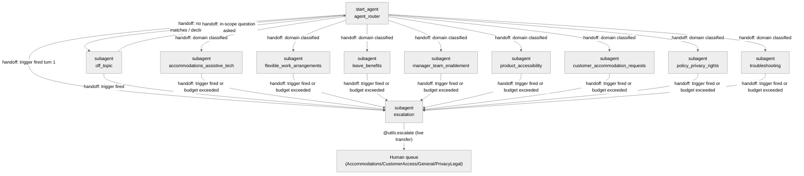

# Agent Spec: AdaptAbility

## Purpose & Scope

AdaptAbility is a deterministic, RAG-grounded FAQ agent built for Everline (a
fictional workplace collaboration SaaS company), serving **both** employees
and customers under one architecture. It combines two hackathon Equality
Group challenge themes — Abilityforce (surfacing accommodations, removing
friction, inclusive employee and customer experience) and Neuroforce
(flexible, adaptive work experiences supporting cognitive diversity). It
answers questions strictly from Salesforce Knowledge via an Agentforce Data
Library (ADL), and hands off to a human specialist through exactly one write
action (Case creation/update) when a conversation requires it. It has no
other write capability: it cannot approve or modify an accommodation
request, change a leave case, order equipment, or change any account
configuration.

This agent reuses the exact deterministic architecture (six-gate pipeline,
one write action, custom session-quality scorers) originally built for a
different fictional company (a B2B SaaS billing/support FAQ agent); the
domains, escalation triggers, and knowledge content below are purpose-built
for this accommodations/accessibility use case, not reskinned from that
original content.

## Behavioral Intent

- The agent must never answer a substantive question without first calling
  `AnswerQuestionsWithKnowledge` and must never answer from its own trained
  knowledge when the returned `knowledgeSummary` is empty or non-substantive.
- Six trigger families force immediate escalation regardless of the active
  subagent: explicit human request, a privacy concern (unauthorized access to
  or disclosure of medical/disability information), a data privacy request
  (access/export/delete personal data), an action the agent cannot execute
  itself (approve/submit a request, order equipment, change a leave case,
  change an account setting), a request needing the user's own case/account
  data, and an urgent legal/interactive-process deadline or safety-critical
  accommodation. These bypass the unresolved-turn counter.
- Retrieval is capped at 2 attempts per question and 3 chained retrievals per
  turn; a session is capped at 12 substantive turns before the agent
  proactively offers a human hand-off; 3 low-confidence/unhelpful responses
  force escalation.
- Clarifying questions are capped at 2 consecutive per topic before the agent
  proceeds best-effort or escalates.
- The only implemented action types are: one Apex escalation action
  (`AdaptAbilityEscalationService.escalateToHuman`) and the platform-standard
  `AnswerQuestionsWithKnowledge` knowledge-retrieval action (wired to an
  Agentforce Data Library — see `docs/data-library-setup.md`, which must be
  recreated per-org since it is not deployable metadata).
- Exact machine-known facts that MUST drive deterministic runtime logic:
  reason-code selection for escalation (a fixed enum, never free LLM text),
  the retrieval/unresolved/clarifying counters and their thresholds, and the
  domain → queue-hint mapping.
- Conversational facts that remain in surviving history and need no variable:
  the user's name, which specific question they asked, prior answers given,
  and ordinary follow-up context — none of these have a runtime consumer.

## Subagent Posture

| Subagent | Posture | Why this posture? | Deterministic controls |
|----------|---------|--------------------|-------------------------|
| `agent_router` | Scripted | Routing must not answer the underlying request; classification-only with one next outcome per branch | Escalation-flag redirect check |
| 8 domain subagents (accommodations & assistive tech, flexible work, leave & benefits, manager enablement, product accessibility, customer accommodation requests, policy/privacy/rights, troubleshooting) | Mixed | The model must interpret free-text questions and compose grounded answers (agentic surface), but retrieval budget, escalation triggers, turn ceiling, and reason-code selection are trust/consequence-bearing and must not vary (scripted surface) | `before_reasoning` topic-change reset; top-of-instructions deterministic redirects on `escalation_reason_code`, `retrieval_attempts >= 2`, `unresolved_turns >= 3`; fixed-enum `setVariables` trigger actions |
| `off_topic` | Scripted | Single fixed decline-and-redirect duty, no free-form answering | Same escalation-flag redirect check |
| `escalation` | Scripted | Regulated, auditable hand-off; exactly one Apex call then one live-transfer call, machine-gated by trusted action output | `available when` sequential gate on `escalation_case_created` |

This is a mostly-scripted, low-agentic-freedom FAQ agent: the only genuinely
agentic surface is composing a grounded answer from `knowledgeSummary` and
recognizing the six trigger families from free text (which AgentScript
cannot inspect deterministically — see Deterministic Controls below). Every
consequential decision downstream of that recognition — which reason code is
sent to Apex, which queue is hinted, when retrieval gives up, when the turn
ceiling forces an offer, when the unresolved-turn counter forces escalation —
is a runtime predicate, not model discretion.

## Subagent Map



All transitions are **handoffs** (`@utils.transition to` / bare
`transition to` + final `@utils.escalate`) — none are delegation-with-return.
Every domain subagent's escalation path is a one-way handoff into
`escalation`; there is no return transition, matching the six-gate
requirement that all trigger paths terminate in the escalation subagent.

## Variables

| Variable | Type / Default | Trusted Writer | Named Consumer | Cause | Reset / Expiry / Correction / Cancel |
|----------|----------------|-----------------|-----------------|-------|----------------------------------------|
| `session_id` | `linked string`, `source: @MessagingSession.Id` | Platform messaging-session context | `escalate_to_human` input `sessionId` | Idempotency key required by Apex | N/A — linked, platform-owned |
| `escalation_reason_code` | `mutable string = ""` | The 6 fixed-enum `trigger_*` actions in every subagent, plus the retrieval-budget and unresolved-turn deterministic checks | Every subagent's top-of-instructions redirect (`if != "": transition to escalation`); `escalate_to_human` input `reasonCode` | All six gates | Never reset after a successful hand-off — `escalation` is a terminal state for the session (see note below) |
| `pending_queue_hint` | `mutable string = ""` | Same triggers as above, each subagent hardcodes its own track's queue literal (`Accommodations` or `CustomerAccess`) | `escalate_to_human` input `queueHint` | Track → queue mapping | Same lifecycle as `escalation_reason_code` |
| `retrieval_attempts` | `mutable number = 0` | `mark_retrieval_empty` (model-invoked, fixed increment) | Domain subagent's `retrieval_attempts >= 2` deterministic check | Retrieval budget / anti-hallucination | Reset to `0` on topic change (`before_reasoning`) |
| `unresolved_turns` | `mutable number = 0` | `mark_retrieval_empty` and `mark_response_unhelpful` (both model-invoked, fixed increment) | Domain subagent's `unresolved_turns >= 3` deterministic check | Forced escalation after repeated low confidence | Reset to `0` on topic change (`before_reasoning`) |
| `clarifying_questions_asked` | `mutable number = 0` | `mark_clarifying_question_asked` (model-invoked, fixed increment) | Domain instructions' 2-question cap guidance | Bounded disambiguation | Reset to `0` on topic change (`before_reasoning`) |
| `turn_count` | `mutable number = 0` | Every domain subagent's `before_reasoning` (unconditional increment) | Domain instructions' `turn_count >= 12` proactive-offer branch | Session turn ceiling | Never reset — session-scoped counter |
| `active_domain` | `mutable string = ""` | Every domain subagent's `before_reasoning` | The topic-change check that resets the three per-topic counters above | Topic-change detection | Overwritten every domain entry |
| `escalation_attempted` | `mutable boolean = False` | `escalate_to_human` output binding | Escalation subagent's retry-branch condition | Distinguish first attempt from retry | Never reset (escalation subagent is terminal) |
| `escalation_case_created` | `mutable boolean = False` | `escalate_to_human` output binding (`@outputs.isSuccess`) | Gates `escalate_to_human` (hides once `True`) and `hand_off_to_human` (shows once `True`) | Idempotent-retry safety + sequential gate | Never reset (escalation subagent is terminal) |
| `escalation_attempts` | `mutable number = 0` | `escalate_to_human` post-action `set` (fixed `+1`) | `escalate_to_human`'s `available when ... and escalation_attempts < 3` gate; the exhausted-attempts instruction branch | Bound repeated retries within one turn | Never reset (escalation subagent is terminal). See Known Platform Limitations below for a caveat on hard transport-level failures. |

**Note on the "never reset" lifecycle of the four escalation-state
variables:** the escalation subagent is designed as a terminal state for the
session — after `hand_off_to_human` (`@utils.escalate`) succeeds, the channel
is expected to end the agent's turn and transfer the session. If a channel
configuration keeps the session alive afterward, leaving these variables set
means the agent stays parked in `escalation` and safely retries the live
hand-off rather than silently returning to answering FAQs after a human
hand-off was already promised. This is a deliberate design choice, not an
oversight.

Ordinary conversational facts (the user's name, which question was asked,
prior answers, current topic phrasing) are **not** mirrored into variables —
surviving conversation history carries them, and no runtime expression needs
the exact value.

## Actions

### AnswerQuestionsWithKnowledge (all 8 domain subagents)

- **Target:** `standardInvocableAction://streamKnowledgeSearch`
- **Status:** IMPLEMENTED (platform-standard action)
- **Wiring:** the top-level `knowledge:` block's `rag_feature_config_id` is a
  placeholder (`ARFPC_REPLACE_WITH_NEW_DATA_LIBRARY_ID`) — a new Agentforce
  Data Library must be created per-org (see `docs/data-library-setup.md`)
  and this value substituted before the agent is usable.

#### Inputs

| Name | Type | Required | Source |
|------|------|----------|--------|
| query | string | Yes | LLM slot-fill (`...`) |
| citationsUrl | string | No | `@knowledge.citations_url` default |
| ragFeatureConfigId | string | No | `@knowledge.rag_feature_config_id` default |
| citationsEnabled | boolean | No | `@knowledge.citations_enabled` default |

#### Outputs

| Name | Type | Visible to User? | Notes |
|------|------|-------------------|-------|
| knowledgeSummary | object (`lightning__richTextType`) | Yes | The grounded answer; empty/non-substantive treated as below-confidence-floor |
| citationSources | object (`@apexClassType/AiCopilot__GenAiCitationInput`) | No | Source links; not deterministically joinable into `articlesServed` |

### escalateToHuman (`escalation` subagent)

- **Target:** `apex://AdaptAbilityEscalationService`
- **Status:** IMPLEMENTED

#### Inputs

| Name | Type | Required | Source |
|------|------|----------|--------|
| sessionId | string | Yes | `@variables.session_id` (linked) |
| reasonCode | string | Yes | `@variables.escalation_reason_code` (fixed enum, never free LLM text) |
| intentSummary | string | Yes | LLM slot-fill (`...`), composed from conversation |
| transcript | string | Yes | LLM slot-fill (`...`), composed from conversation |
| sentimentTrend | string | Yes | LLM slot-fill (`...`), instructed to one of improving/flat/declining, default flat |
| articlesServed | string | Yes | LLM slot-fill (`...`), instructed to send the literal text `"none"` rather than `""` when no articles were served — the platform's invocable-action layer treats an empty string as a missing required value regardless of the Agent Script `is_required` setting, even though the underlying Apex only null-checks it (confirmed on the original build; carried forward as a fixed pattern) |
| queueHint | string | No | `@variables.pending_queue_hint` (fixed enum literal per domain) |

#### Outputs

| Name | Type | Visible to User? | Notes |
|------|------|-------------------|-------|
| isSuccess | boolean | No (`filter_from_agent: True`) | Captured into `escalation_case_created` |
| caseId | string | No (`filter_from_agent: True`) | Not surfaced to the user (internal Salesforce record Id) |
| errorMessage | string | No (`filter_from_agent: True`) | Drives the retry branch conversationally without echoing raw Apex text |

## Action Invocation Strategy

| Action | Subagent | Invocation Mode | Why |
|--------|----------|------------------|-----|
| AnswerQuestionsWithKnowledge | all 8 domains | Planner slot-fill (`with query=...`) | The model must judge when a question is substantive enough to search, and compose the search query |
| escalate_to_human (`escalateToHuman`) | escalation | Planner slot-fill, gated `available when escalation_case_created == False` | Requires model-composed `intentSummary`/`transcript`/`sentimentTrend`; the sequential gate makes it fire effectively automatically on entry since the else-branch instruction is unconditional |
| hand_off_to_human (`@utils.escalate`) | escalation | Planner slot-fill, gated `available when escalation_case_created == True` | Live transfer must not happen before the Case exists |
| `trigger_human_request` / `trigger_privacy_concern` / `trigger_data_privacy_request` / `trigger_action_required` / `trigger_employee_specific_case_data` / `trigger_urgent_deadline_or_safety` | router, off_topic, all 8 domains | `@utils.setVariables` with fixed literal `set` clauses (no LLM-supplied values) | Model classifies *which* trigger applies (unavoidable — see Deterministic Controls); the value written is a hardcoded enum, never free text |
| `mark_retrieval_empty` / `mark_response_unhelpful` / `mark_clarifying_question_asked` | all 8 domains | `@utils.setVariables` with fixed `+1` increment | Model reports an event; the counter arithmetic and threshold enforcement are deterministic |

## Deterministic Controls (mapped to the six gates)

**Gate 1 — Forced-trigger check.** AgentScript's deterministic layer
(`before_reasoning`, `if` in `instructions: ->`) can only evaluate
`@variables`, `@outputs`, and `@inputs` — it has no documented mechanism to
inspect the raw user utterance (no substring/`contains` operator, no linked
variable exposing current message text). **None of the six triggers are
therefore truly pre-reasoning-deterministic** in the sense of running before
any LLM involvement. What IS fully deterministic: once the model recognizes a
trigger and calls the matching fixed-enum `trigger_*` action, the very next
reasoning iteration re-resolves `instructions: ->` and hits
`if @variables.escalation_reason_code != "": transition to @subagent.escalation`
**before the LLM is invoked again** — this transition cannot be
second-guessed, skipped, or overridden by model judgment, and the
`reasonCode` value sent to Apex is always one of the 9 valid enum literals,
never freeform text. This "model-classifies, runtime-dispatches-and-cannot-
be-overridden" pattern is identical for all six triggers; the difference
between them is only in prompt-level judgment burden:
- `human_request`, `privacy_concern` — crude, near-zero-judgment
  keyword/phrase recognition.
- `data_privacy_request`, `action_required`, `employee_specific_case_data`,
  `urgent_deadline_or_safety` — genuine intent classification, more judgment
  required, but identical deterministic dispatch once classified.

This shared pattern is replicated in the router, `off_topic`, and all 8
domain subagents (not centralized, since AgentScript has no cross-subagent
include mechanism) so it applies "regardless of which domain subagent is
active," including turn 1.

**Gate 2 — Routing.** `agent_router` is a router-first architecture: 8 domain
transition actions + `off_topic` for anything else (including the
always-declined categories — legal advice, medical advice, competitor
disparagement, non-Everline topics — encoded as router and `off_topic`
guardrail instructions). AgentScript has no platform-reserved "Off-Topic"
subagent primitive; `off_topic` is authored per the documented
guardrail-subagent pattern.

**Gate 3 — Grounded retrieval with confidence floor.** `knowledgeSummary` is
a rich-text `object` output; the model recognizes an empty/non-substantive
result in prose ("Answer only from knowledgeSummary. If it is empty...") and
calls `mark_retrieval_empty` (fixed `+1` to `retrieval_attempts` and
`unresolved_turns`). The threshold enforcement itself is 100% deterministic:
`if @variables.retrieval_attempts >= 2: set @variables.escalation_reason_code
= "no_confident_answer" ... transition to @subagent.escalation`,
re-evaluated every reasoning iteration.

**Gate 4 — Response shape.** Clarifying-question cap
(`clarifying_questions_asked`, +1 per `mark_clarifying_question_asked` call,
capped at 2 by instruction guidance — the cap itself is not enforced by an
`available when` gate because "ask one question" is inherently a model
judgment call, not a machine-checkable precondition). Step-sequencing (≤3
steps = one response, ≥4 = walk through with check-ins) is implemented as an
**instruction-level approximation only** — there is no persisted-variable
step-navigation/back-button state.

**Gate 5 — Conversation limits.** Retrieval budget = `retrieval_attempts`
(above). Turn ceiling = `turn_count`, incremented unconditionally in each
domain subagent's `before_reasoning`, checked in instructions (`>= 12` →
proactive hand-off offer, reusing the existing `trigger_human_request` action
if the user accepts — no new reason code needed). Unresolved-turns = same
mechanism as retrieval budget, plus `mark_response_unhelpful` for explicit
user dissatisfaction; reset on topic change via the `active_domain` check in
`before_reasoning`.

**Gate 6 — Escalation subagent.** All six trigger paths transition into the
single `escalation` subagent (see Subagent Map). It calls `escalateToHuman`
gated `available when escalation_case_created == False` (prevents a
duplicate call once the Case exists, though the Apex action is itself
idempotent on `sessionId`), captures `isSuccess`/`caseId`/`errorMessage` into
variables, then exposes `hand_off_to_human` (`@utils.escalate`) only once
`escalation_case_created == True` — a textbook External-Outcome Sequential
Gate. Instructions require a plain-language transition message before
`hand_off_to_human` is called (never a silent end of turn), and a retry
message (not a silent failure) if `isSuccess` is `False`.

## Architecture Pattern

Router-first (`start_agent agent_router`) with 8 domain subagents, one
guardrail subagent (`off_topic`), and one escalation subagent — required
because the agent has 8 genuinely distinct domains spanning two audience
tracks (employee and customer) with different Knowledge visibility scopes
and different queue-hint mappings, plus a privacy/safety boundary (Gate 1)
and an escalation authority boundary (Gate 6) that must be separately
scoped. All cross-subagent transitions are one-way handoffs; none
delegate-with-return, since no subagent needs to resume after another
subagent runs (each escalation path terminates the conversation via the
escalation subagent, and domain switches are user-driven re-routes, not
callbacks).

## Regression Test Suite

`tests/AdaptAbility-testing-center.yaml` — a Testing Center
(`AiEvaluationDefinition`) suite covering all 8 domain routings, off-topic/
legal-advice guardrails, all 6 forced-trigger escalation families, an
informational-vs-action-required pair for trigger-precision testing, a
fully-specified request that must skip clarification, an ungroundable/
no-fabrication check, and a cross-track (employee vs. customer) routing
pair proving the two tracks don't leak into each other's Knowledge scope.
**Not yet deployed or run against a live org** — this build has not been
connected to a target org. `sf agent test create`/`test run` require
`subjectName` to resolve to a real `BotDefinition`, which only exists after
`sf agent publish authoring-bundle`. Once a target org exists and the agent
is published, run:

```bash
sf agent test create --json --spec tests/AdaptAbility-testing-center.yaml --api-name AdaptAbility_Regression -o <targetOrg>
sf agent test run --json --api-name AdaptAbility_Regression --wait 10 --result-format json -o <targetOrg>
```

## Known Platform Limitations (carried over from the reference build — re-verify once deployed)

This agent has not yet been tested against a live org. The items below were
observed during live testing of the reference build this architecture is
based on (a different fictional company/domain, same Agent Script mechanics)
and are expected to apply here since they're platform/Agent Script behavior,
not content-specific — but they have **not been independently re-confirmed
for AdaptAbility** and should be re-verified once a target org exists.

1. **A platform-injected content classifier may intercept formal legal-rights
   phrasing.** On the reference build, requests that named "GDPR" or "right
   to erasure" explicitly were intercepted by an undocumented
   `Inappropriate_Content` platform node before the router ever ran, while
   plain-language equivalents ("please delete my data") routed and escalated
   correctly. AdaptAbility's `trigger_data_privacy_request` and
   `trigger_privacy_concern` triggers are phrased in plain language (not
   citing specific statutes), which may avoid this — but formal phrasing
   invoking disability-rights law (e.g. "under the ADA," "my right to
   reasonable accommodation") should be explicitly tested once a target org
   exists, since the same undocumented classifier may fire on different
   legal-citation phrasing in this domain too.
2. **`sessionId` cannot be populated via `sf agent preview`.** The
   `session_id` variable sources from `@MessagingSession.Id`, which does not
   resolve in a bare CLI preview session (no real messaging channel is
   attached). Every live-mode `escalateToHuman` call in preview will fail
   with `REQUIRED_FIELD_MISSING: sessionId`. Expected to work correctly once
   the agent runs behind a real messaging channel — re-verify via Testing
   Center or a real channel session before publish.
3. **`articlesServed` requires the literal text `"none"`, not an empty
   string.** The platform's invocable-action dispatcher rejects an
   empty-string value for a required field before Apex's own (null-only)
   validation runs, independent of the Agent Script `is_required` setting.
   Already worked around in the Agent Script by instructing the model to
   send `"none"` rather than `""` — carried forward unchanged.
4. **Escalation retry cap does not bound a hard transport/execution-level
   failure.** `escalation_attempts` increments via a post-action `set` that
   only executes when the action returns a normal Apex-level result (success
   or `isSuccess: False`). A platform-level execution error (e.g. an HTTP 500
   before Apex runs) may bypass the `set` entirely, so the 3-attempt cap
   would not bound retries in that specific failure mode. No code change
   made for this pass — same residual gap as the reference build.
5. **`action_required` and `employee_specific_case_data` trigger calibration
   will need tuning from real usage.** The boundary between "asking about an
   action" (informational) and "asking for an action" (transactional) is a
   judgment call the model will not always resolve consistently — this was
   observed on the reference build's analogous triggers and is architecturally
   inherent to Gate 1 having no true pre-reasoning-deterministic detection
   (see Deterministic Controls). Add borderline utterances to the regression
   suite as they're discovered in real testing.

## Agent Configuration

- **developer_name:** `AdaptAbility`
- **agent_label:** `AdaptAbility`
- **agent_type:** `AgentforceServiceAgent`
- **access.default_agent_user:** `agentforce_service_agent@00daj00000uvhm5802865891.ext` — this is the reference build's org-specific integration user and **will not exist in a new org**. Replace with the target org's own Agentforce Service Agent user, holding an equivalent to `AdaptAbility_Escalation_Access` (Case CRUD + FLS, `Knowledge__kav` + `Summary` field read, `AdaptAbilityEscalationService` Apex access).
- **knowledge.rag_feature_config_id:** placeholder `ARFPC_REPLACE_WITH_NEW_DATA_LIBRARY_ID` — see `docs/data-library-setup.md`.
- **Permissions:** not yet verified against a real org — verify once a target org exists.
